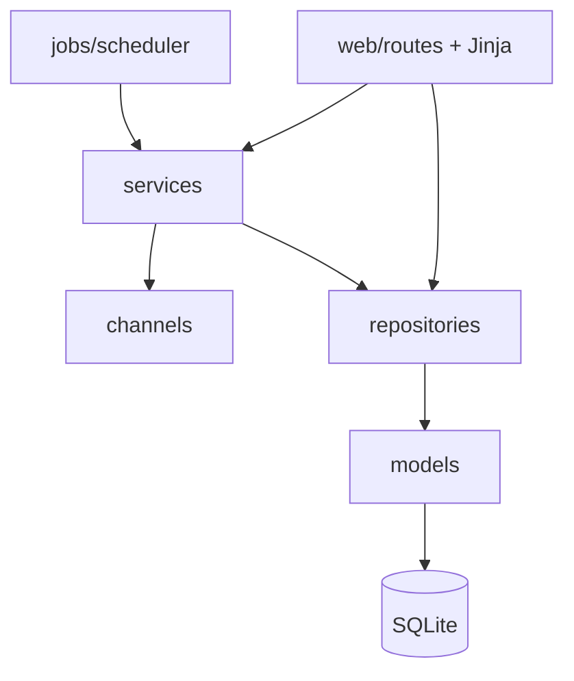
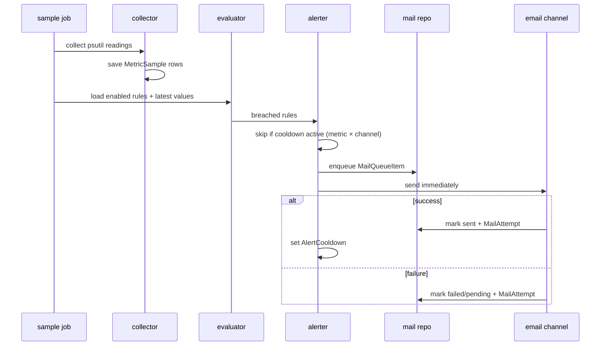

# Gaugora — Coding Architecture

Companion to [plan.md](./plan.md). This is the implementation blueprint for v1.

## Package layout

```text
Gaugora/
├── pyproject.toml              # uv project + deps
├── .env.example
├── Dockerfile
├── docker-compose.yml          # app + volume for SQLite
├── README.md
├── documents/
│   ├── plan.md
│   └── architecture.md
└── src/
    └── gaugora/
        ├── __init__.py
        ├── __main__.py         # python -m gaugora
        ├── app.py              # Flask create_app()
        ├── config.py           # settings from env
        ├── extensions.py       # db engine/session, scheduler
        ├── models/
        │   ├── __init__.py
        │   ├── metric.py       # MetricDefinition, MetricSample
        │   ├── alert.py        # AlertRule, AlertCooldown
        │   └── mail.py         # SmtpSettings, MailQueueItem, MailAttempt
        ├── repositories/
        │   ├── __init__.py
        │   ├── metrics.py
        │   ├── alerts.py
        │   └── mail.py
        ├── services/
        │   ├── __init__.py
        │   ├── collector.py    # psutil sampling
        │   ├── evaluator.py    # rule check: metric > N%
        │   ├── alerter.py      # cooldown + enqueue + immediate send
        │   ├── mailer.py       # SMTP send + retry helpers
        │   └── retention.py    # prune samples per metric
        ├── channels/
        │   ├── __init__.py
        │   ├── base.py         # Channel protocol / interface
        │   └── email.py        # v1 implementation
        ├── jobs/
        │   ├── __init__.py
        │   └── scheduler.py    # APScheduler: sample, retry, prune
        └── web/
            ├── __init__.py
            ├── routes/
            │   ├── __init__.py
            │   ├── dashboard.py
            │   ├── metrics.py
            │   ├── rules.py
            │   ├── settings.py
            │   └── mail.py
            ├── templates/
            │   ├── base.html
            │   ├── dashboard.html
            │   ├── metrics.html
            │   ├── rules.html
            │   ├── settings.html
            │   └── mail_queue.html
            └── static/
                ├── css/
                └── js/
```

**Why this shape**
- `models` / `repositories` / `services` = thin data layer without full hexagonal ceremony.
- `channels` isolates email now; Telegram/Slack can plug in later behind the same interface.
- `jobs` owns background work so Flask routes stay request-scoped.
- `src/gaugora` layout works cleanly with `uv` and `python -m gaugora`.

## Layer responsibilities



| Layer | Does | Does not |
|-------|------|----------|
| `web` | HTTP, forms, templates | Direct SQL / SMTP |
| `jobs` | Schedule sample / retry / prune | Business rules themselves |
| `services` | Collect, evaluate, alert, send, retain | Flask request objects |
| `channels` | Deliver a message on a channel | Know about rules or cooldown |
| `repositories` | CRUD / queries | Threshold logic |
| `models` | Schema / ORM mapping | I/O side effects |

## Process model (one container)

On startup (`create_app` + `__main__`):

1. Load config from `.env`.
2. Init DB (create tables / light migrate).
3. Seed default metric definitions if empty.
4. Start APScheduler:
   - **sample job** — every N seconds (config).
   - **mail retry job** — every ~15–30s.
   - **retention job** — hourly (or daily).
5. Run Flask (waitress/gunicorn or Flask dev for local).

All three jobs share the same process and SQLite DB (check_same_thread / SQLAlchemy session per job carefully).

## Domain flows

### Sample → alert → mail



### Mail retry

- Select items in `pending` / `failed` with `next_retry_at <= now` and `attempts < max`.
- Attempt send; write `MailAttempt`; update status / backoff `next_retry_at`.

### Retention

- For each `MetricDefinition`, delete `MetricSample` older than `retention_days` (or hours—see open defaults below).

## Data model (v1)

### `metric_definitions`
| Column | Notes |
|--------|--------|
| id | PK |
| key | e.g. `cpu_percent`, `memory_percent`, `disk_percent` (unique) |
| name | Display name |
| retention_days | Per-metric retention |
| enabled | Whether sampled |
| created_at / updated_at | |

### `metric_samples`
| Column | Notes |
|--------|--------|
| id | PK |
| metric_key | FK/index to definition key |
| value | Float (percent 0–100) |
| collected_at | Indexed for charts + prune |

### `alert_rules`
| Column | Notes |
|--------|--------|
| id | PK |
| name | |
| metric_key | |
| operator | Fixed `>` in v1 (store for forward-compat) |
| threshold | Float percent |
| channels | JSON list, e.g. `["email"]` |
| cooldown_seconds | Used with cooldown table |
| enabled | |
| created_at / updated_at | |

### `alert_cooldowns`
| Column | Notes |
|--------|--------|
| id | PK |
| rule_id | |
| metric_key | |
| channel | e.g. `email` |
| last_sent_at | Unique-ish on `(rule_id, channel)` or `(metric_key, channel, rule_id)` |

Cooldown key for v1: **`(rule_id, channel)`** (implies metric via the rule). Aligns with “per metric × channel” when one rule maps to one metric.

### `smtp_settings`
| Column | Notes |
|--------|--------|
| id | Singleton row (id=1) |
| host, port, use_tls | |
| username, password | |
| from_address | |
| to_addresses | JSON list or comma-separated |
| updated_at | |

### `mail_queue`
| Column | Notes |
|--------|--------|
| id | PK |
| channel | `email` |
| rule_id | nullable FK |
| subject, body | |
| to_addresses | Snapshot at enqueue time |
| status | `pending` / `sent` / `failed` |
| attempts | Int |
| last_error | |
| next_retry_at | |
| created_at, sent_at | |

### `mail_attempts`
| Column | Notes |
|--------|--------|
| id | PK |
| queue_id | FK |
| attempted_at | |
| success | Bool |
| error | |

## Config (`.env`)

```text
GAUGORA_SECRET_KEY=
GAUGORA_DATABASE_URL=sqlite:////data/gaugora.db
GAUGORA_SAMPLE_INTERVAL_SECONDS=60
GAUGORA_MAIL_RETRY_INTERVAL_SECONDS=30
GAUGORA_MAIL_MAX_ATTEMPTS=5
GAUGORA_HOST=0.0.0.0
GAUGORA_PORT=8080
```

SMTP lives in DB (UI-editable); optional env bootstrap for first run is fine later.

## Web routes (v1)

| Path | Purpose |
|------|---------|
| `GET /` | Dashboard: latest metrics + recent alerts/mail |
| `GET /metrics` | History + charts; retention edit per metric |
| `GET/POST /rules` | List / create rules |
| `GET/POST /rules/<id>` | Edit / delete |
| `GET/POST /settings/smtp` | SMTP + recipients |
| `GET /mail` | Queue + attempt log; optional resend |

No auth middleware.

## Dependencies (uv)

- `flask`
- `sqlalchemy`
- `psutil`
- `apscheduler`
- `python-dotenv`
- `waitress` (or similar) for container serving

## Implementation order

1. uv project scaffold + config + Flask app factory + Docker skeleton  
2. Models + DB init + repositories  
3. Collector + sample job + metric UI (history/retention)  
4. Rules CRUD + evaluator + cooldown  
5. Email channel + queue + immediate send + retry job + mail UI  
6. Dashboard polish + Dockerfile volume + README  

## Defaults to confirm when coding starts

These are proposed defaults (change anytime):

- Sample interval: **60s**
- Metrics seeded: **cpu_percent**, **memory_percent**, **disk_percent** (root `/`)
- Default retention: **7 days** per metric
- Default cooldown: **300s** per rule/channel
- Mail backoff: exponential-ish (e.g. 30s, 60s, 120s…) capped
- Disk metric: single root path `/` unless UI later adds paths
