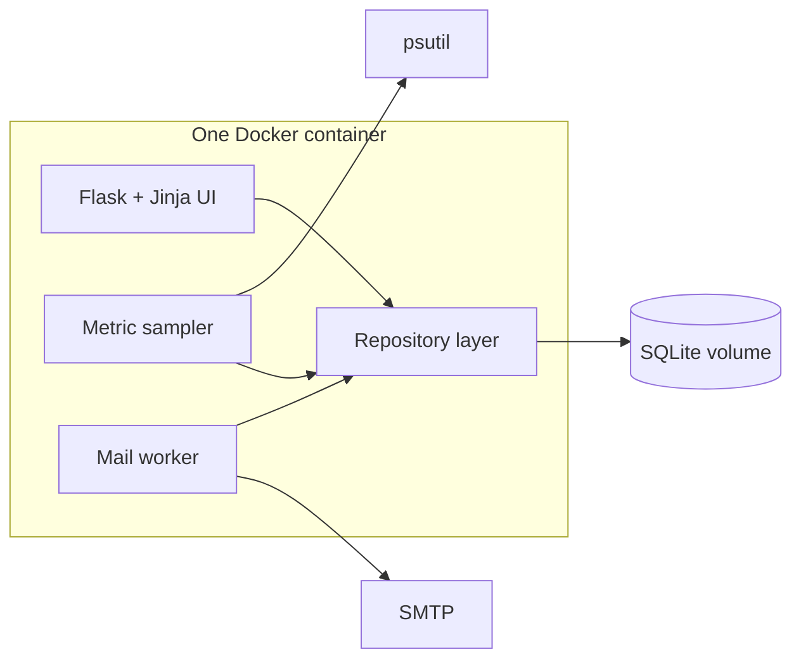

# Gaugora

Python resource monitoring agent that runs on each VM, samples local usage with `psutil`, evaluates alert rules, and notifies via email. Managed through a Flask + Jinja UI.

## Goals (v1)

- Monitor one host (agent deployed on the VM itself).
- Collect CPU / memory / disk (and related) metrics on a schedule.
- Store metric history with **per-metric retention**.
- Alert when `metric > N%`, with **cooldown per metric × channel**.
- Email only for delivery in v1; rules still expose channel selection for later (Telegram, Slack, etc.).
- Real **mail queue**: enqueue → send immediately → background retry loop; UI shows queue / send log.
- No authentication.

## Architecture

- **Single container** runs UI, sampler, and mail worker (one Python process with scheduled jobs preferred).
- **SQLite** for local storage (DB file on a Docker volume).
- **Thin repository / SQLAlchemy-style layer** — not full hexagonal multi-DB yet; enough isolation to swap to Postgres/MySQL later via connection URL + adapter if needed.

## Data & behavior

### Metrics
- Sampled on an internal schedule (cron-like, e.g. APScheduler).
- Persisted to DB.
- Retention length configurable **per metric**; old rows pruned accordingly.

### Alert rules
- Condition shape for v1: **`metric > N%`** only.
- Channels selectable per rule; **email implemented first**.
- Cooldown scoped **per metric × channel** so the same breach does not spam every sample tick.

### Mail queue
- On alert fire: create queue row → **attempt send immediately**.
- Failed sends retried by a background loop.
- Statuses at least: `pending`, `sent`, `failed` (with attempt history / send log in UI).

### Config
- DB path / connection and secrets via `.env` where appropriate.
- SMTP (sender, credentials, recipients) and operational settings manageable from UI / env as needed for v1.

## UI (all required in v1)

- Rules CRUD
- SMTP / mail settings
- Metrics history / charts
- Mail queue and send log

## Out of scope for v1

- Multi-host central collector
- Telegram / Slack delivery (channel option UI only)
- Auth / multi-user
- Full hexagonal adapters for every SQL dialect
- Alert conditions beyond `metric > N%` (e.g. sustained windows, process checks)

## Roadmap (mail / diagnostics)

| Version | Mail format | Notes |
|---------|-------------|--------|
| **v1 / v2** | **Plain text** | Alert body with who (top processes) + partial why (host context). Keep readable tables in monospace text. |
| **v3** | **HTML + plain-text fallback** | Multipart email, cleaner process table, **Gaugora logo**, still include plain text for clients that prefer it. |

Do **not** add HTML email templates before v3.

## Implementation notes

- Stack: Python, `psutil`, Flask, Jinja, SQLite, Docker.
- Prefer one process (Flask + sampler + mail retry loop) over multiple supervisord processes unless isolation is needed later.
- Mount a volume for the SQLite file so data survives container restarts.

Coding layout, schema, and build order: see [architecture.md](./architecture.md).
